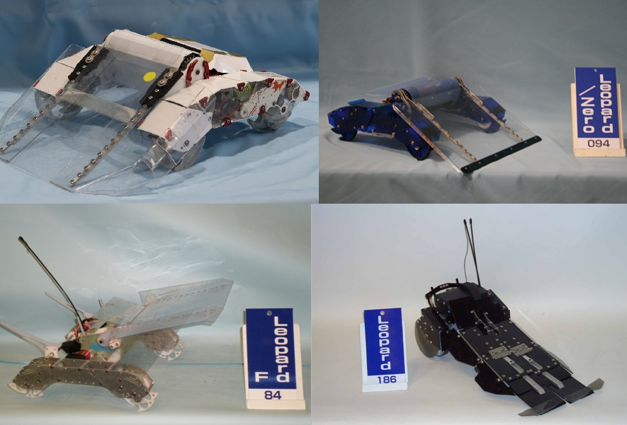
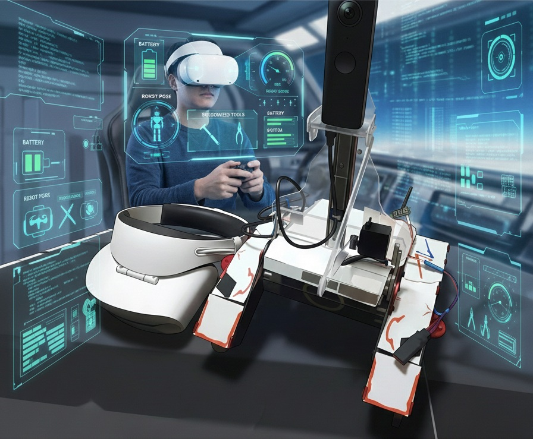
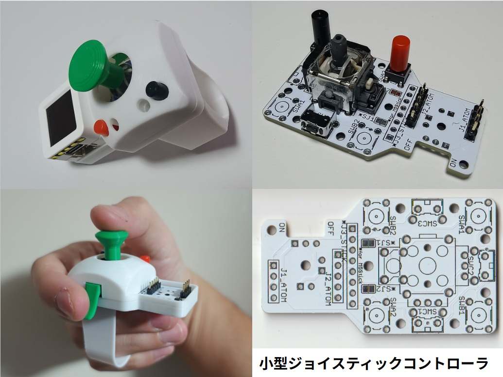
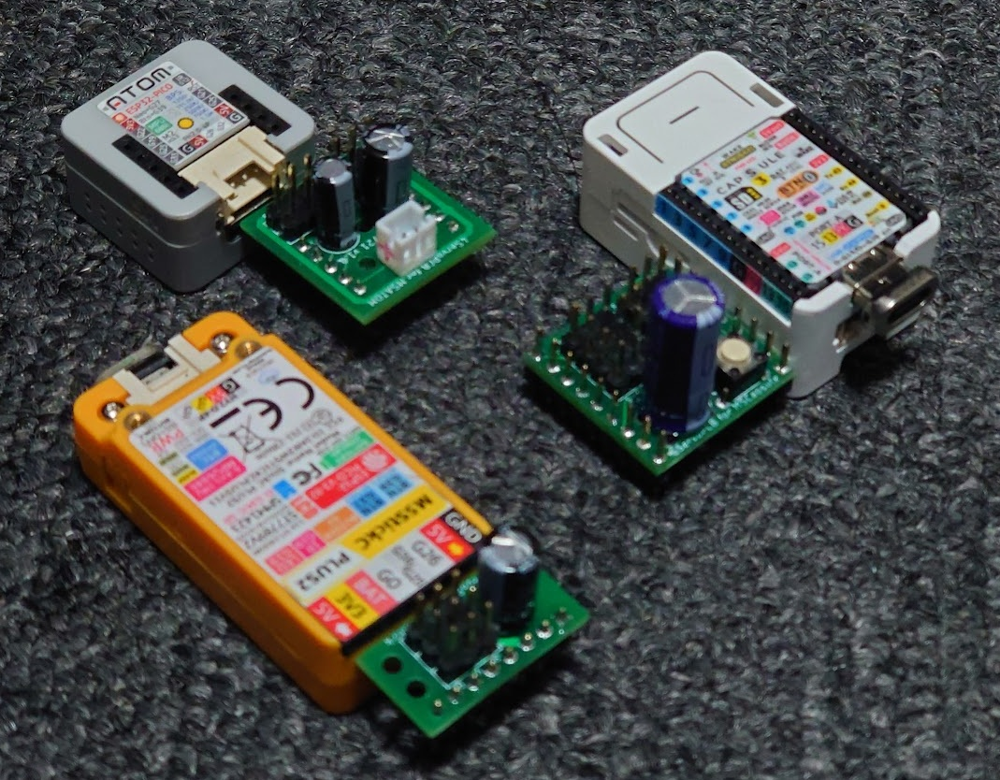
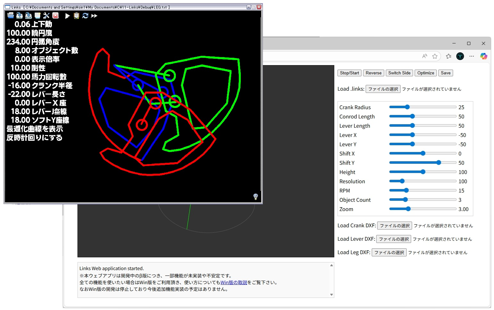
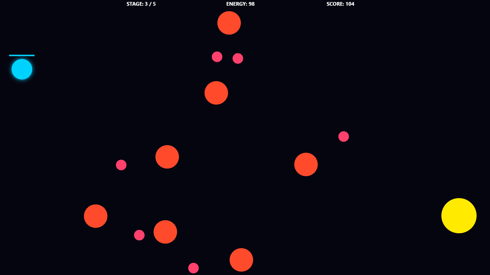
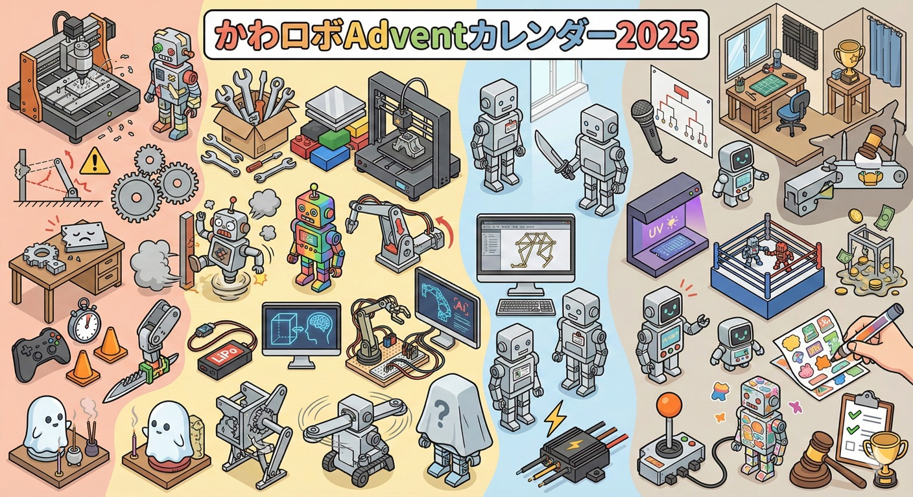
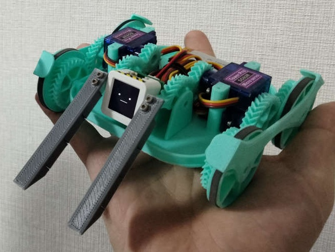

## 新着情報
+ 【26/05/05】 ブログ記事[「ウェブサイトを作成しました。」](https://sin1n24.hatenablog.com/entry/2026/05/05/042705)を公開しました。
+ 【26/04/27】 26/05/06 [生成AIなんでも展示会 Vol.5](https://www.genai-expo.com/)に出展します！
+ 【26/04/19】 26/5/30-31 国内最大級の3Dプリンタのイベント[JRRF](https://japanreprapfestival.com/)に出展＆[ミニ大会](https://sin1n24.hatenablog.com/entry/2026/03/24/223605)を開催します！

## ロボット

### [Leopard](https://sin1n24.hatenablog.com/entry/2023/09/05/233955){: .btn }

かわさきロボット競技大会出場機体。独自のリンク機構設計と制御基板。
`Robotics` `ESP32` `EasyEDA` `Mechanism`

[詳細を見る](https://sin1n24.hatenablog.com/entry/2023/09/05/233955){: .btn }

---

### [VR遠隔操縦システム](https://docs.google.com/presentation/d/102zdY-PNOnPTbznJMxDMi7jyg4cydIe-_hQr4PIHcWo/edit?usp=sharing){: .btn }

自作ロボットに搭乗する代わりにthetaとVRゴーグルで乗ってるつもりに。
`Robotics` `Mechanism` `Unity`

[スライドを見る](https://docs.google.com/presentation/d/102zdY-PNOnPTbznJMxDMi7jyg4cydIe-_hQr4PIHcWo/edit?usp=sharing){: .btn }

---

## ハードウエア

### [小型ジョイスティックコントローラ](https://sin1n24.hatenablog.com/entry/2025/01/24/005304){: .btn }

M5ATOMとStickに対応した最大3ボタン2軸ジョイスティックの小型コントローラ。スイッチサイエンスで委託販売中。
`M5Stack` `AtomS3` `Joystick` `Robotics`

[詳細を見る](https://sin1n24.hatenablog.com/entry/2025/01/24/005304){: .btn }
[販売サイト](https://www.switch-science.com/collections/all/cat:スイッチサイエンスマーケットプレイス（委託商品）_sin1’s-studio){: .btn }

---

### [M5Stack向 サーボ接続基板](https://sin1n24.hatenablog.com/entry/2024/01/03/010304){: .btn }

M5StickC/Atom/Capsule各シリーズに対応したサーボ接続基板。スイッチサイエンスで委託販売中。
`M5Stack` `Hardware` `Eagle` `Servo`

[詳細を見る](https://sin1n24.hatenablog.com/entry/2024/01/03/010304){: .btn }
[販売サイト](https://www.switch-science.com/collections/all/cat:スイッチサイエンスマーケットプレイス（委託商品）_sin1’s-studio){: .btn }

---

## ソフトウエア

### [Links](https://sin1n24.hatenablog.com/entry/2025/12/15/222244){: .btn }

リンク機構シミュレータ、かわロボ設計補助ソフト。AI活用し、ウェブアプリ移植途中。
`DxLib` `C++` `Jules` `Inverse Kinematics`

[詳細を見る](https://sin1n24.hatenablog.com/entry/2025/12/15/222244){: .btn }

---

### [かわロボVR](https://sin1n24.hatenablog.com/entry/2018/10/29/213618){: .btn }

物理演算のあるVR空間上でロボットの操縦練習や試運転やネット対戦ができます。Quest/Android対応。
`Unity` `Android` `Mechanism`

[詳細を見る](https://sin1n24.hatenablog.com/entry/2018/10/29/213618){: .btn }

---

### [ORBITAL_DRIFT](https://sin1.studio/ORBITAL_DRIFT/){: .btn }

高専の時に最初に作ったアクションミニゲームをAIで再現してみました。
`Vanilla JS` `Canvas 2D` `Game`

[詳細を見る](https://sin1.studio/ORBITAL_DRIFT/){: .btn }

---

## 企画

### [かわロボアドベントカレンダー](https://sin1n24.hatenablog.com/entry/2025/12/25/233111){: .btn }

クリスマス前に皆でかわロボの記事を書く恒例イベント（毎年開催）。技術交流会も実施しました。
`Adventor`

[ブログ記事を読む](https://sin1n24.hatenablog.com/entry/2025/12/25/233111){: .btn }

---

### [ミニかわロボ](https://sin1.studio/MiniKawaRobo/){: .btn }

手のひらサイズの格闘対戦ロボット競技規格。ミニ大会随時開催中。最新情報に掲載します。
`Fusion` `M5Stack` `C++`

[詳細を見る](https://sin1.studio/MiniKawaRobo/){: .btn }

---

[その他の作品（ProtoPedia）](https://protopedia.net/prototyper/sin1){: .btn }

---
### 　
### 　
### 　

{: width="300px" .center-img }