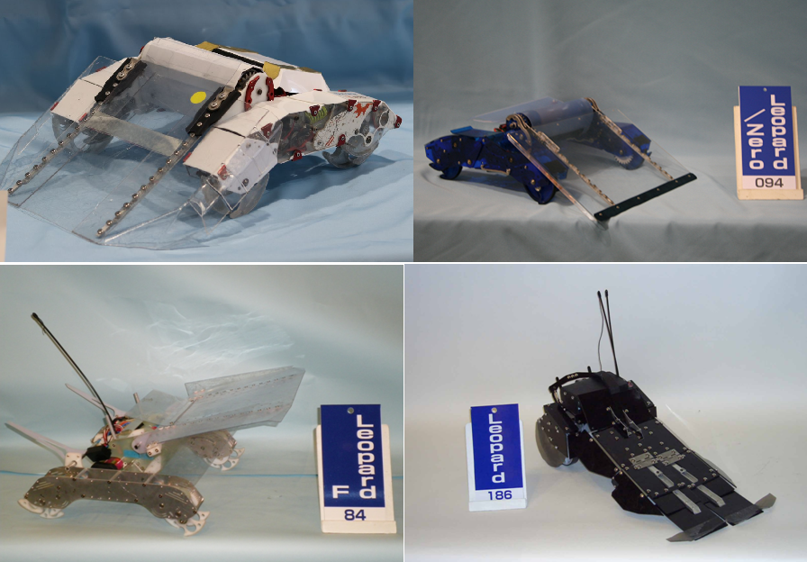
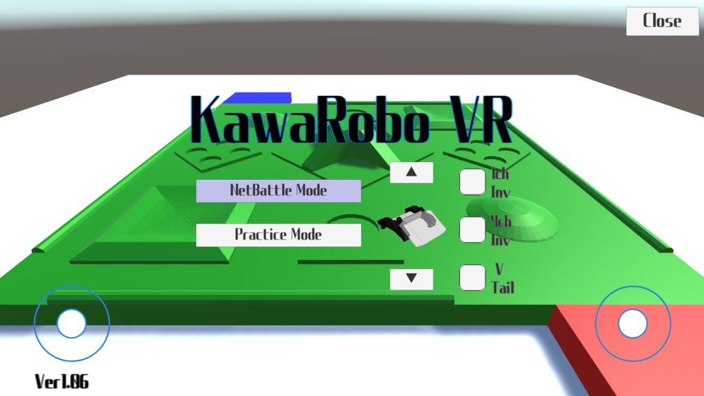

## 製作物

### [【ソフトウエア】Links](https://sin1n24.hatenablog.com/entry/2025/12/15/222244){: .btn }

リンク機構シミュレータ、かわロボ設計補助ソフト。AI活用し、ウェブアプリ移植途中。
`DxLib` `C++` `Jules` `Inverse Kinematics`

[詳細を見る](https://sin1n24.hatenablog.com/entry/2025/12/15/222244){: .btn }

---

### [【ロボット】Leopard](https://sin1n24.hatenablog.com/entry/2023/09/05/233955){: .btn }

かわさきロボット競技大会出場機体。独自のリンク機構設計と制御基板。
`Robotics` `ESP32` `EasyEDA` `Mechanism`

[詳細を見る](https://sin1n24.hatenablog.com/entry/2023/09/05/233955){: .btn }

---

### [【ロボ＆VRソフト】VR遠隔操縦システム](https://docs.google.com/presentation/d/102zdY-PNOnPTbznJMxDMi7jyg4cydIe-_hQr4PIHcWo/edit?usp=sharing){: .btn }

自作ロボットに搭乗する代わりにthetaとVRゴーグルで乗ってるつもりに。
`Robotics` `Mechanism` `Unity`

[スライドを見る](https://docs.google.com/presentation/d/102zdY-PNOnPTbznJMxDMi7jyg4cydIe-_hQr4PIHcWo/edit?usp=sharing){: .btn }

---

### [【VRソフトウエア】かわロボVR](https://sin1n24.hatenablog.com/entry/2018/10/29/213618){: .btn }

物理演算のあるVR空間上でロボットの操縦練習や試運転やネット対戦。
`Unity` `Android` `Mechanism`

[詳細を見る](https://sin1n24.hatenablog.com/entry/2018/10/29/213618){: .btn }

---

## 企画

### [かわロボアドベントカレンダー](https://sin1n24.hatenablog.com/entry/2025/12/25/233111){: .btn }

クリスマス前に皆でかわロボの記事を書く恒例イベント（毎年開催）。技術交流会も計画中。
`Adventor`

[ブログ記事を読む](https://sin1n24.hatenablog.com/entry/2025/12/25/233111){: .btn }

---

### [ミニかわロボ](https://protopedia.net/prototype/5154){: .btn }

手のひらサイズの格闘対戦ロボット競技規格。ミニ大会随時開催中。
`Fusion` `M5Stack` `C++`

[ProtoPediaで見る](https://protopedia.net/prototype/5154){: .btn }

---

## Technical Stack

- C++
- Fusion
- M5Stack
- Unity
- Android
- Mechanism
- Robotics
- DxLib
- Jules
- Inverse Kinematics
