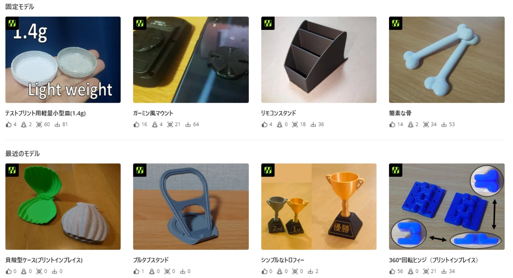

## 新着情報
+ 【26/05/22】 [MakerWorld](https://makerworld.com/en/@sin1west)で3Dモデルを公開中という作品紹介を追加
+ 【26/05/14】 ESP-NOWワイヤレスカメラロボット「[RobotS3RCam](https://github.com/sin1n24/RobotS3RCam)」を公開しました！
+ 【26/05/11】 26/05/09-10 [つくろがや！](https://tsukurogaya.nagoya/)に出展しました！報告は[こちら](https://x.com/sin1west/status/2052669653626094036)から。
+ 【26/05/07】 26/05/06 [生成AIなんでも展示会 Vol.5](https://www.genai-expo.com/)に出展しました！報告は[こちら](https://x.com/sin1west/status/2051863112140378419)から。
+ 【26/05/07】 初心者相談AI「ミニかわBot」を公開しました。ロボット作りで迷ったら相談してみて下さい！
+ 【26/05/05】 ブログ記事[「ウェブサイトを作成しました。」](/blog/)を公開しました。
+ 【26/04/19】 26/5/30-31 国内最大級の3Dプリンタのイベント[JRRF](https://japanreprapfestival.com/)に出展＆[ミニ大会](https://sin1n24.hatenablog.com/entry/2026/03/24/223605)を開催します！

## ロボット

### [Leopard](https://sin1n24.hatenablog.com/entry/2023/09/05/233955){: .btn }

かわさきロボット競技大会出場機体。独自のリンク機構設計と制御基板。
`Robotics` `ESP32` `EasyEDA` `Mechanism`

[詳細を見る](https://sin1n24.hatenablog.com/entry/2023/09/05/233955){: .btn }

---

### [ロボット遠隔操作システム](https://github.com/sin1n24/RobotS3RCam){: .btn }

AtomS3R-CAMとAtomS3Rによる無線遠隔操縦FPVロボットシステム。低遅延で安価・小型。オープンソース。
`ESP32` `ESP-NOW` `M5Stack` `AtomS3R` `FPV` `Robotics`

[GitHubを見る](https://github.com/sin1n24/RobotS3RCam){: .btn }

---

### [VR遠隔操縦システム](https://docs.google.com/presentation/d/102zdY-PNOnPTbznJMxDMi7jyg4cydIe-_hQr4PIHcWo/edit?usp=sharing){: .btn }

自作ロボットに搭乗する代わりにthetaとVRゴーグルで乗ってるつもりに。
`Robotics` `Mechanism` `Unity`

[スライドを見る](https://docs.google.com/presentation/d/102zdY-PNOnPTbznJMxDMi7jyg4cydIe-_hQr4PIHcWo/edit?usp=sharing){: .btn }

---

## ハードウエア

### [小型ジョイスティックコントローラ](https://sin1n24.hatenablog.com/entry/2025/01/24/005304){: .btn }

M5ATOMとStickに対応した最大3ボタン2軸ジョイスティックの小型コントローラ。スイッチサイエンスで委託販売中。
`M5Stack` `AtomS3` `Joystick` `Robotics`

[詳細を見る](https://sin1n24.hatenablog.com/entry/2025/01/24/005304){: .btn }
[販売サイト](https://www.switch-science.com/collections/all/cat:スイッチサイエンスマーケットプレイス（委託商品）_sin1's-studio){: .btn }

---

### [M5Stack向 サーボ接続基板](https://sin1n24.hatenablog.com/entry/2024/01/03/010304){: .btn }

M5StickC/Atom/Capsule各シリーズに対応したサーボ接続基板。スイッチサイエンスで委託販売中。
`M5Stack` `Hardware` `Eagle` `Servo`

[詳細を見る](https://sin1n24.hatenablog.com/entry/2024/01/03/010304){: .btn }
[販売サイト](https://www.switch-science.com/collections/all/cat:スイッチサイエンスマーケットプレイス（委託商品）_sin1's-studio){: .btn }

---

### [MakerWorld 3Dモデル](https://makerworld.com/en/@sin1west){: .btn }

BambuLabが運営する3Dモデル共有サイトで3Dデータを公開中。ライセンス販売はご相談下さい。
`3D Print` `BambuLab` `MakerWorld` `Bambu`

[モデル一覧を見る](https://makerworld.com/en/@sin1west){: .btn }
[24年度 3Dモデル紹介記事](https://sin1n24.hatenablog.com/entry/2025/04/06/232358){: .btn }

---

## ソフトウエア

### [Links](https://sin1n24.hatenablog.com/entry/2025/12/15/222244){: .btn }

リンク機構シミュレータ、かわロボ設計補助ソフト。AI活用しウェブアプリ版(β)を公開中。
`DxLib` `C++` `JavaScript` `Jules` `Inverse Kinematics`

[詳細を見る](https://sin1n24.hatenablog.com/entry/2025/12/15/222244){: .btn }
[ウェブ版を試す](https://sin1.studio/Links/){: .btn }

---

### [かわロボVR](https://sin1n24.hatenablog.com/entry/2018/10/29/213618){: .btn }

物理演算のあるVR空間上でロボットの操縦練習や試運転やネット対戦ができます。Quest/Android対応。
`Unity` `Android` `Mechanism`

[詳細を見る](https://sin1n24.hatenablog.com/entry/2018/10/29/213618){: .btn }

---

### [ORBITAL_DRIFT](https://sin1.studio/ORBITAL_DRIFT/){: .btn }

高専の時に最初に作ったアクションミニゲームをAIで再現してみました。
`Vanilla JS` `Canvas 2D` `Game`

[詳細を見る](https://sin1.studio/ORBITAL_DRIFT/){: .btn }

---

## 企画

### [かわロボアドベントカレンダー](https://sin1n24.hatenablog.com/entry/2025/12/25/233111){: .btn }

クリスマス前に皆でかわロボの記事を書く恒例イベント（毎年開催）。技術交流会も実施しました。
`Adventor`

[ブログ記事を読む](https://sin1n24.hatenablog.com/entry/2025/12/25/233111){: .btn }

---

### [ミニかわロボ](https://sin1.studio/MiniKawaRobo/){: .btn }

手のひらサイズの格闘対戦ロボット競技規格。ミニ大会随時開催中。最新情報に掲載します。
`Fusion` `M5Stack` `C++`

[公式サイト](https://sin1.studio/MiniKawaRobo/){: .btn }
[ミニかわBot](https://sin1.studio/MiniKawaRobo/docs/bot.html){: .btn }

---

[その他の作品（ProtoPedia）](https://protopedia.net/prototyper/sin1){: .btn }

---
### 　
### 　
### 　

{: width="300px" .center-img }
